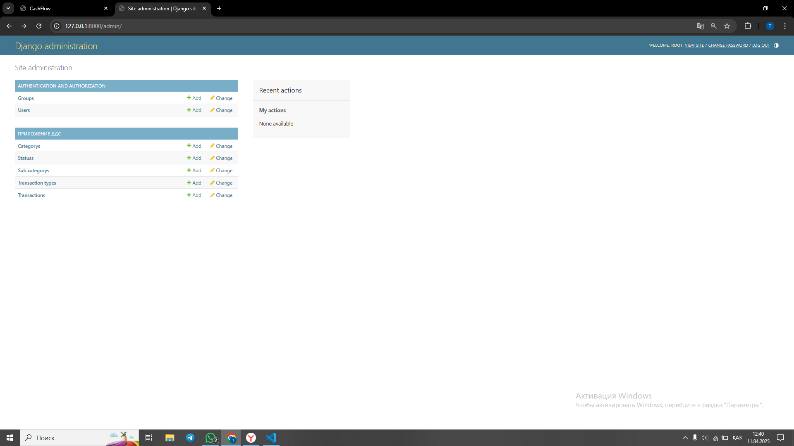
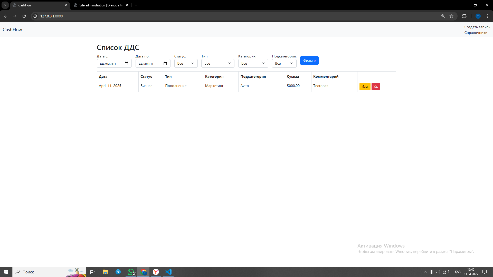
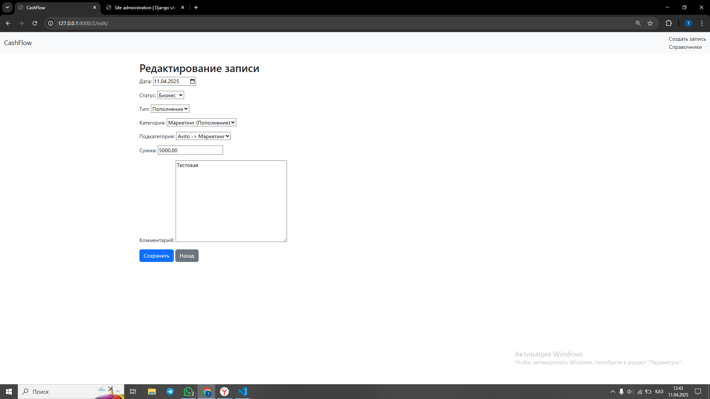
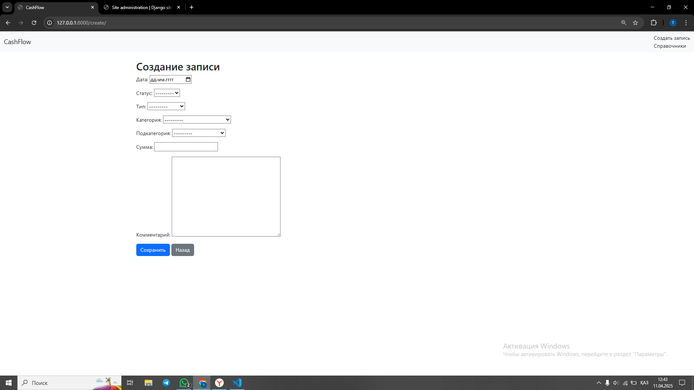
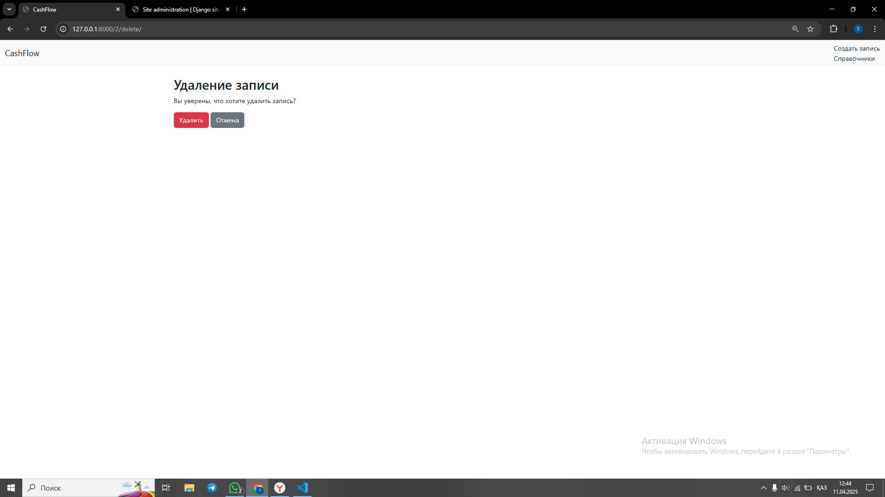
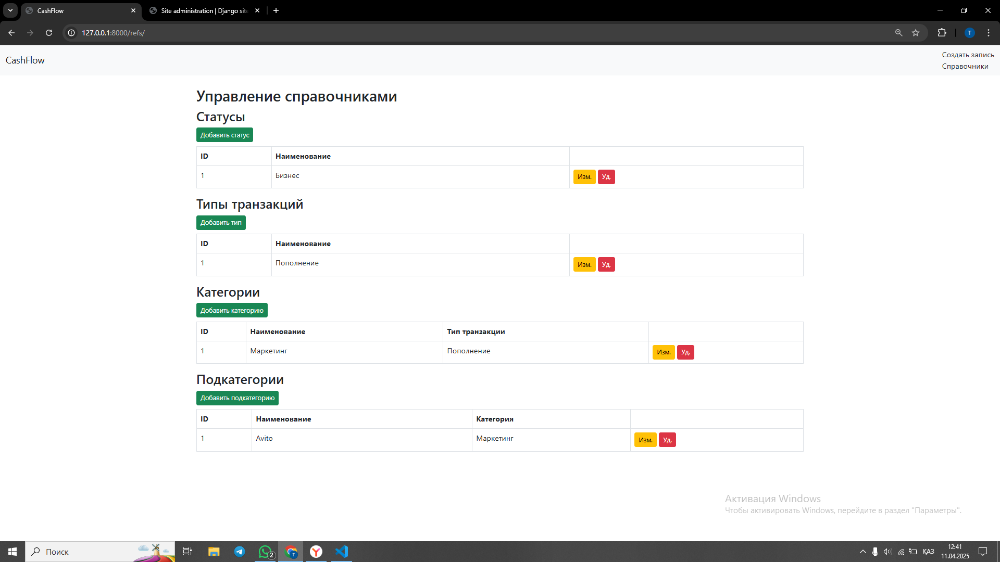

## Использование CashFlow (Django)

Простое веб-приложение для учёта движения денежных средств (ДДС).  
Позволяет создавать, редактировать, удалять и просматривать записи о движении денежных средств, а также управлять справочниками (статусы, типы, категории и подкатегории).

---

## 1. Возможности приложения

1. **Создание записи о движении денежных средств (ДДС)**:
   - Поля: дата, статус, тип, категория, подкатегория, сумма, комментарий.
   - Поддерживается автоматическое заполнение даты (можно изменить вручную).
   - Обязательные поля: сумма, тип, категория, подкатегория.

2. **Просмотр списка всех записей**:
   - Табличный вывод (дата, статус, тип, категория, подкатегория, сумма, комментарий).
   - Фильтрация по дате (с/по), статусу, типу, категории, подкатегории.

3. **Редактирование записи**:
   - Можно изменить дату, статус, тип, категорию, подкатегорию, сумму и комментарий.

4. **Удаление записи**:
   - Удалить любую запись из списка.

5. **Управление справочниками**:
   - **Статусы** (например, Бизнес, Личное, Налог...).
   - **Типы** (например, Пополнение, Списание...).
   - **Категории** (привязаны к определённому типу).
   - **Подкатегории** (привязаны к конкретной категории).
   - Добавление, редактирование и удаление каждой сущности.

6. **Логические зависимости**:
   - Подкатегория не может быть выбрана, если она не соответствует выбранной категории.
   - Категория не может быть выбрана, если она не соответствует выбранному типу.

7. **Базовая валидация**:
   - Проверка на стороне сервера (Django Forms/Model).
   - Поля «тип», «категория», «подкатегория» и «сумма» обязательны для заполнения.
---
## 2. Установка и запуск
### 2.1. Клонирование репозитория

```bash
https://github.com/Tastanbai/Cashflow.git
cd cashflow

2.2. Создание виртуального окружения (рекомендуется) 
python -m venv venv

Linux/Mac:  source venv/bin/activate
Windows (PowerShell): venv\Scripts\activate

2.3. Установка зависимостей
pip install -r requirements.txt

2.4. Настройка базы данных
По умолчанию используется SQLite (файл db.sqlite3 создаётся автоматически).

2.5. Применение миграций
python manage.py migrate

2.6. Создание суперпользователя
python manage.py createsuperuser

Это позволит вам войти в админ-панель Django по адресу:
http://127.0.0.1:8000/admin/.

2.7. Запуск веб-приложения
python manage.py runserver

После запуска сервер будет доступен по адресу:
http://127.0.0.1:8000/.

Скриншоты интерфейса

Админ-панель


Главная страница


Редактирование записи


Создание записи


Удаление записи


Управление справочниками



